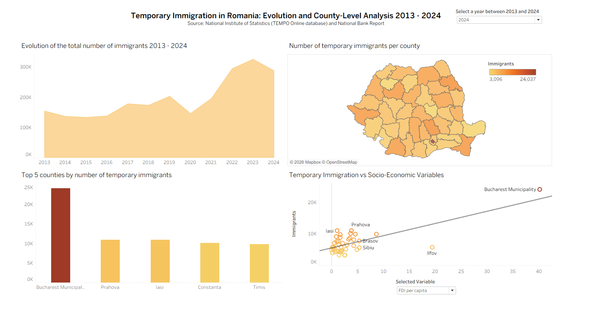

# # Analysis of Temporary Immigration of the Romanian Population (2013-2024)

---

## Project Overview

This project analyzes the evolution and territorial distribution of temporary immigration in Romania between 2013 and 2024 using statistical, econometric, and data visualization techniques.

The analysis combines:
- socio-economic variables at county level,
- panel data econometrics,
- interactive visualizations,
- data preprocessing and statistical analysis.

The project was developed using:
- Python (data preprocessing and variable construction),
- Tableau (interactive dashboards and visual analytics),
- R (panel econometric modeling).

## Data Sources

The analysis is based on official public data obtained from:
- National Institute of Statistics (INS / TEMPO Online)
- National Bank of Romania
The database covers all Romanian counties for the period 2013–2024.

## Socio-Economic Variables

The panel database includes the following variables:

| Variable | Description |
|---|---|
| Temporary immigrants | Number of temporary immigrants by county |
| Dependency index | Demographic dependency ratio |
| Enterprises per capita | Number of enterprises relative to population |
| FDI per capita | Foreign direct investments per inhabitant |
| Occupancy rate | Employment/occupancy rate |
| Real salary | Inflation-adjusted average salary |ry |

## Data Processing and Feature Engineering (Python)

The raw datasets were processed and transformed using Python in Jupyter Notebook.

Main preprocessing operations included:
- cleaning and standardizing county-level datasets,
- handling missing values,
- merging multiple datasets into a panel structure,
- calculating derived indicators,
- transforming nominal salary into real salary using the consumer price index,
- computing per capita indicators,
- exporting processed datasets to Excel format for further analysis.

Libraries used:
- Pandas
- NumPy

## Interactive Dashboard (Tableau)

An interactive Tableau dashboard was developed to explore:
- the evolution of temporary immigration over time,
- county-level territorial distribution,
- top counties by immigration level,
- relationships between immigration and socio-economic indicators.

Dashboard features:
- dynamic year filter,
- interactive county-level map,
- comparative visualizations,
- scatter plot analysis between variables.
- 
The county-level map was created in Tableau by joining the processed panel dataset with Romanian county shapefiles in order to build geographic visualizations.

**[👉 View the Dashboard on Tableau Public](https://public.tableau.com/app/profile/vlad.pirvan/viz/TemporaryImmigrationfromRomania2013-2024/Dashboard)**

## Panel Econometric Analysis (R)

The econometric analysis was performed in R using panel data regression models.

Methods used:
- Fixed Effects Model (FE)
- Random Effects Model (RE)
- Hausman Test
- Robust Standard Errors
- Multicollinearity diagnostics (VIF)
- Residual diagnostics and normality tests

The analysis aimed to identify the socio-economic determinants influencing temporary immigration across Romanian counties over time.

The econometric analysis script includes:
- descriptive statistics,
- correlation analysis,
- panel regression estimation,
- diagnostic testing,
- robust standard errors,
- model interpretation and comparison.

## Main Findings

Key results of the analysis include:
- positive influence of FDI (Foreign Direct Investment)  on temporary immigration,
- significant relationship between demographic and economic indicators,
- strong territorial disparities between counties,
- Bucharest Municipality as a major outlier in immigration attraction.

---

## Technologies Used

- Python
- Jupyter Notebook
- Pandas
- NumPy
- R
- plm
- lmtest
- sandwich
- Tableau
- Excel

## Future Improvements

Possible future extensions:
- spatial econometric models,
- predictive migration analysis,
- integration of additional socio-economic indicators.
